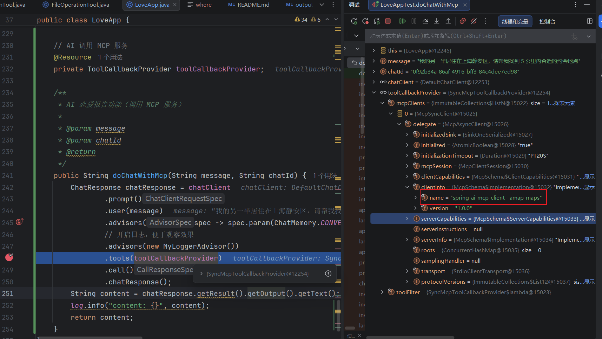
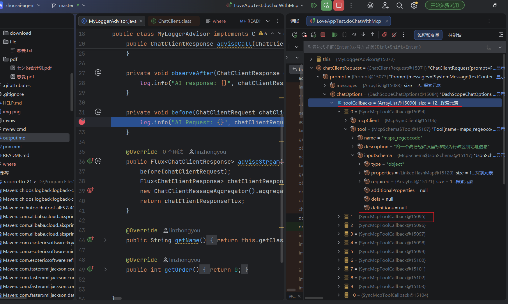
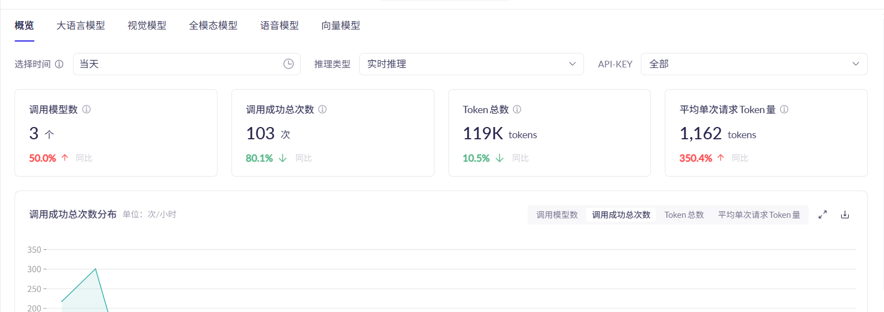
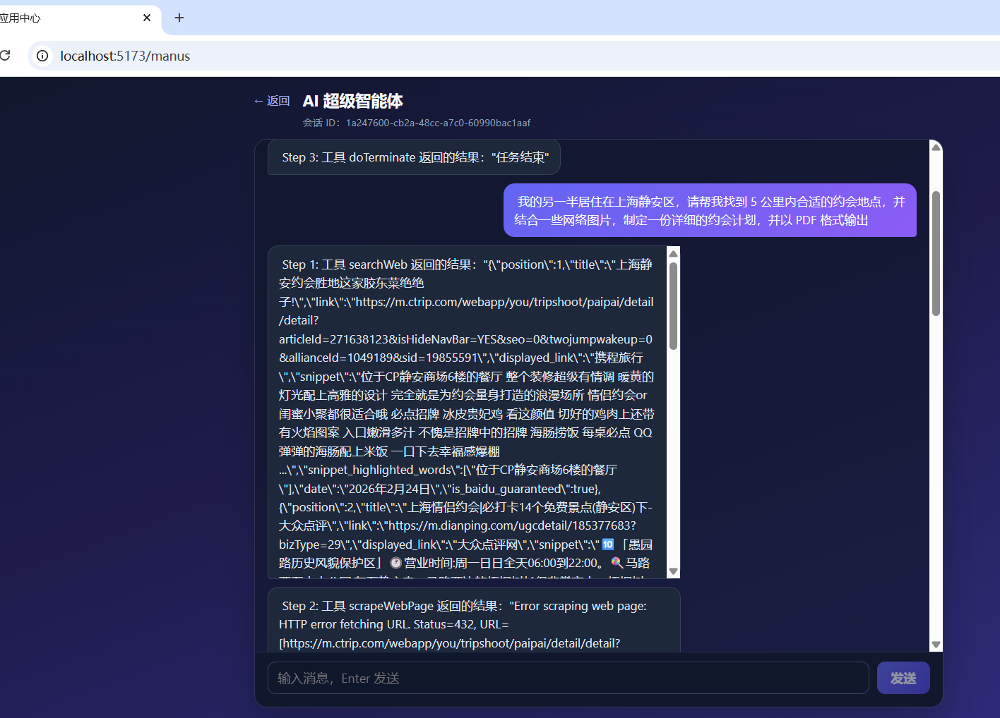

# Zhou AI Agent

> 基于 Spring AI + Vue 3 的全栈 AI 智能体应用，集成 RAG、工具调用、MCP 协议及自主规划能力
>

## 项目简介

Zhou AI Agent 是一个端到端的 AI 智能体平台，涵盖后端服务、前端界面和 MCP 扩展服务三个组件。项目演示了从基础 AI 对话到高级智能体能力的完整演进路径：对话记忆 → 结构化输出 → RAG 知识增强 → 工具调用 → MCP 协议扩展 → 自主规划执行的 ReAct 智能体。

核心亮点包括「AI 情感大师」多场景对话应用，以及「ZhouManus」拥有自主规划能力的全能型 AI 智能体，可自动拆解任务、选择工具并逐步执行。


## 功能特性

- **AI 情感大师** — 多轮对话、流式输出、RAG 知识增强、结构化输出
- **ZhouManus 智能体** — 自主规划执行的 ReAct 模式 Agent，支持内置工具 + MCP 扩展工具，可自动终止
- **RAG 系统** — Agentic RAG（查询路由 + 向量检索 + 兜底处理），支持查询改写与文档过滤
- **MCP 协议集成** — 动态工具发现与热插拔，支持 REST API 和配置文件热加载双模式
- **记忆持久化** — 基于 JDBC + PostgreSQL 的会话记忆持久化，支持滑动窗口
- **可观测性** — Langfuse + Micrometer Tracing + OpenTelemetry，追踪 LLM 调用链路
- **SSE 流式响应** — Flux<String> 线程安全流式输出，兼容 SseEmitter / ServerSentEvent

## 项目结构

| 目录 | 技术栈 | 说明 |
|------|--------|------|
| `src/` | Spring Boot 3.4 + Spring AI | 后端主应用（智能体、RAG、工具、API） |
| `zhou-ai-agent-frontend/` | Vue 3 + Vite + TypeScript | 聊天界面前端（双模式对话界面） |
| `zhou-image-search-mcp-server/` | Spring Boot 3.4 + MCP Server | 图像搜索 MCP 服务（Pexels API） |

## 技术栈

**后端 Backend**
- Java 21, Spring Boot 3.4.4, Spring AI 1.0.0
- Spring AI Alibaba + DashScope（通义千问 Qwen）
- PGVector（PostgreSQL 向量数据库）
- Knife4j / OpenAPI 3（API 文档）
- iTextPDF, Jsoup, Hutool, Kryo
- Micrometer Tracing + OpenTelemetry（可观测性）
- Langfuse（AI 可观测性平台）

**前端 Frontend**
- Vue 3.5, TypeScript, Vite 6
- Vue Router 4, Axios

**MCP Server**
- Spring Boot 3.4.5, Spring AI MCP Server
- Pexels API（图像搜索）

**基础设施 Infrastructure**
- Docker Compose（一键启动 Langfuse + PostgreSQL）
- PostgreSQL + pgvector（向量存储 + 记忆持久化）

## 快速开始

### 环境要求

- JDK 21
- Node.js 18+
- PostgreSQL（可选，用于 PGVector 持久化向量存储）
- Maven 3.9+

### 1. 配置 API Key

在启动前，需要配置以下 API Key：

| 配置项 | 文件位置 | 说明 |
|--------|----------|------|
| `spring.ai.dashscope.api-key` | `src/main/resources/application.yaml` | 阿里云 DashScope API Key（通义千问模型） |
| `search-api.api-key` | `src/main/resources/application.yaml` | SearchAPI.io API Key（网页搜索功能） |
| `AMAP_MAPS_API_KEY` | `src/main/resources/mcp-servers.json` | 高德地图 MCP Server API Key |
| Pexels API Key | `zhou-image-search-mcp-server/src/main/resources/application.yaml` | 图像搜索 MCP Server 的 Pexels API Key |

### 2. 启动后端

```bash
# 配置好 API Key 后
mvn spring-boot:run
# 后端运行在 http://localhost:8123/api
```

### 3. 启动前端

```bash
cd zhou-ai-agent-frontend
npm install
npm run dev
# 前端运行在 http://localhost:5173，自动代理 /api 到后端 8123 端口
```

### 4. 启动 MCP Server（可选）

```bash
cd zhou-image-search-mcp-server
# 配置 Pexels API Key
mvn spring-boot:run
# MCP Server 运行在 http://localhost:8127
```

## API 接口

| 接口 | 方法 | 说明 |
|------|------|------|
| `/api/ai/love_app/chat/sync` | GET | 同步对话（AI 情感大师） |
| `/api/ai/love_app/chat/sse` | GET | SSE 流式对话（Flux 方式） |
| `/api/ai/love_app/chat/server_sent_event` | GET | SSE 流式对话（ServerSentEvent 包装） |
| `/api/ai/love_app/chat/sse_emitter` | GET | SSE 流式对话（SseEmitter 方式） |
| `/api/ai/manus/chat` | GET | 智能体流式对话（ZhouManus，SseEmitter） |
| `/api/ai/manus/chat/flux` | GET | 智能体流式对话（ZhouManus，Flux 推荐） |
| `/api/mcp/servers` | GET | 列出所有已注册的 MCP Server |
| `/api/mcp/servers` | POST | 注册新的 MCP Server |
| `/api/mcp/servers/{name}` | DELETE | 移除 MCP Server |
| `/api/mcp/servers/refresh` | POST | 从配置文件重新加载 MCP Server |
| `/api/mcp/servers/tools` | GET | 列出所有可用工具 |
| `/health` | GET | 健康检查 |
| `/actuator` | GET | Spring Boot Actuator 端点 |

API 文档访问：`http://localhost:8123/api/swagger-ui.html`（Knife4j）
Langfuse 可观测性面板：`http://localhost:3000`（docker-compose 启动后）

## 智能体架构

ZhouManus 采用四层继承架构，实现「思考 → 行动」的自主循环：

```
┌─────────────────────────────────────────────┐
│                  ZhouManus                   │
│          (具体智能体，配置提示词和工具)          │
├─────────────────────────────────────────────┤
│              ToolCallAgent                   │
│   think(): 调用 LLM 判断是否需要工具          │
│   act():  手动执行 LLM 选择的工具              │
├─────────────────────────────────────────────┤
│               ReActAgent                     │
│   step() = think() + act()                  │
│   先思考再行动的循环模式                        │
├─────────────────────────────────────────────┤
│               BaseAgent                      │
│   Agent Loop: 最多执行 maxSteps 步            │
│   状态管理: IDLE → RUNNING → FINISHED/ERROR   │
│   会话记忆: 维护 messageList 上下文             │
└─────────────────────────────────────────────┘
```

**BaseAgent（基础层）** — 负责"循环引擎"：定义 agent 主循环，最多跑 20 步，管理状态机（空闲 → 运行中 → 完成/出错），维护对话记忆。子类只需实现 `step()` 方法定义每一步做什么。

**ReActAgent（推理层）** — 实现"先想后做"模式：把 `step()` 拆成 `think()`（思考）和 `act()`（行动）两个抽象方法。这层只定义执行顺序，不关心具体怎么思考、怎么行动。

**ToolCallAgent（工具层）** — 实现具体的思考和行动：`think()` 调用 LLM，让大模型判断需要哪些工具；`act()` 手动执行这些工具（禁用了 Spring AI 内置的自动工具调用，改为手动控制）。

**ZhouManus（应用层）** — 具体的智能体实例：配置系统提示词（"你是全能助手"）、接入所有工具、设置最大步数。

**终止机制**：两种方式跳出循环 — ① 调用 `TerminateTool`（大模型判断任务完成时主动调用）；② 达到最大步数 20 步（兜底保护，防止无限循环）。

## 可用工具列表

**内置工具**（`src/main/java/com/zhou/zhouaiagent/tools/`）:

| 工具 | 说明 |
|------|------|
| `TerminateTool` | 终止智能体执行，通知 Agent 任务已完成 |
| `WebSearchTool` | 百度网页搜索（通过 SearchAPI.io，返回前 5 条结果） |
| `WebScrapingTool` | 网页内容抓取（基于 Jsoup） |
| `FileOperationTool` | 文件读写操作（操作 `tmp/file/` 目录） |
| `TerminalOperationTool` | 执行终端/Shell 命令 |
| `PDFGenerationTool` | 生成 PDF 文档（iTextPDF，支持中文字体） |
| `ResourceDownloadTool` | 从 URL 下载资源文件（保存到 `tmp/download/`） |

**MCP 扩展工具**:

| 工具 | 来源 | 说明 |
|------|------|------|
| `searchImage` | 自定义 MCP Server | 通过 Pexels API 搜索图片（`zhou-image-search-mcp-server`） |
| `amap-maps` 系列工具 | 高德地图 MCP | 地理编码、路径规划、POI 搜索等地图服务（`@amap/amap-maps-mcp-server`） |

## Docker 部署

### 单容器部署

```bash
docker build -t zhou-ai-agent .
docker run -p 8123:8123 zhou-ai-agent
```

### 完整环境（含 Langfuse + PostgreSQL）

```bash
# 启动所有服务（Langfuse + PostgreSQL + pgvector）
docker-compose up -d

# 服务列表：
# - Langfuse: http://localhost:3000（可观测性面板）
# - PostgreSQL (Langfuse): localhost:5432
# - PostgreSQL (pgvector): localhost:5433

# 停止服务
docker-compose down
```

## 核心模块详解

### 记忆持久化（JDBC）

基于 `JdbcChatMemoryRepository` 实现会话记忆的持久化存储，服务重启后会话不丢失。

```
┌─────────────────────────────────────────────────┐
│              MessageWindowChatMemory              │
│          滑动窗口：保留最近 20 条消息              │
├─────────────────────────────────────────────────┤
│           JdbcChatMemoryRepository               │
│   存储：type + content + metadata 三列            │
│   序列化：Jackson JSON（避免 Kryo 兼容性问题）     │
├─────────────────────────────────────────────────┤
│              PostgreSQL + JDBC                   │
│   自动建表，支持多会话隔离                         │
└─────────────────────────────────────────────────┘
```

### MCP 动态工具发现与热插拔

支持运行时动态添加/移除 MCP Server，无需重启服务。

```
┌─────────────────────────────────────────────────┐
│              McpServerController                 │
│   REST API: POST/DELETE/GET /mcp/servers         │
├─────────────────────────────────────────────────┤
│              McpToolRegistry                     │
│   ConcurrentHashMap 管理所有 MCP Server 连接      │
│   支持 SSE 模式注册和工具发现                      │
├─────────────────────────────────────────────────┤
│         DynamicToolCallbackProvider              │
│   统一管理：内置工具 + MCP 工具 + 动态工具         │
│   CopyOnWriteArrayList 保证线程安全               │
├─────────────────────────────────────────────────┤
│         McpConfigFileWatcher                     │
│   WatchService 监听 mcp-servers.json 文件变更      │
│   文件修改时自动刷新 MCP Server 连接               │
└─────────────────────────────────────────────────┘
```

### 可观测性（Langfuse）

通过 Micrometer Tracing + OpenTelemetry 追踪 LLM 调用链路。

```
┌─────────────────────────────────────────────────┐
│               Langfuse 面板                      │
│   可视化 Agent 执行链路、Token 消耗、延迟          │
├─────────────────────────────────────────────────┤
│           OpenTelemetry OTLP Exporter            │
│   自动采集 Traces → 发送到 Langfuse               │
├─────────────────────────────────────────────────┤
│              @Observed 注解                      │
│   BaseAgent.run()     → agent.run                │
│   ToolCallAgent.think() → agent.think            │
│   ToolCallAgent.act()  → agent.act               │
└─────────────────────────────────────────────────┘
```

### Agentic RAG

整合查询路由、向量检索、兜底处理的完整 RAG Pipeline。

```
┌─────────────────────────────────────────────────┐
│              QueryRouter                         │
│   关键词匹配：恋爱/婚姻/感情等 → 走 RAG            │
│   短文本 + 无问号 → 直接回答                       │
├─────────────────────────────────────────────────┤
│       VectorStoreDocumentRetriever               │
│   语义相似度检索，topK=3，阈值 0.5                 │
│   基于 PGVector 向量存储                          │
├─────────────────────────────────────────────────┤
│              兜底策略                             │
│   检索为空 → LLM 直接回答                          │
│   检索有结果 → 构建上下文 → LLM 基于资料回答        │
└─────────────────────────────────────────────────┘
```

### Flux 流式处理

统一使用 `Flux<String>` 实现线程安全的流式输出。

```java
// BaseAgent.runStreamFlux() 核心实现
Flux.create(sink -> {
    Schedulers.boundedElastic().schedule(() -> {
        for (int i = 0; i < maxSteps; i++) {
            String stepResult = step();
            sink.next("Step " + (i+1) + ": " + stepResult);
        }
        sink.complete();
    });
}, FluxSink.OverflowStrategy.BUFFER);
```

## 面试亮点总结

| 技术点 | 面试问题 | 项目实现 |
|--------|----------|----------|
| Agent 架构 | 如何设计一个可扩展的 Agent 系统？ | 四层继承架构：BaseAgent → ReActAgent → ToolCallAgent → ZhouManus |
| 工具调用 | 如何控制工具调用的时机？ | 禁用 Spring AI 内置机制，think() 判断 + act() 手动执行 |
| 记忆管理 | 服务重启后会话丢失怎么办？ | JdbcChatMemoryRepository + PostgreSQL 持久化 |
| MCP 协议 | 如何运行时动态添加工具？ | McpToolRegistry + REST API + 配置文件热加载 |
| RAG 策略 | 如何提升 RAG 检索效果？ | 查询路由 + 语义检索 + 兜底策略 |
| 流式输出 | 如何实现线程安全的流式推送？ | Flux.create() + FluxSink + Schedulers.boundedElastic() |
| 可观测性 | 如何监控 Agent 的 Token 消耗？ | Langfuse + @Observed + OpenTelemetry OTLP |
| 终止机制 | 如何防止 Agent 无限循环？ | TerminateTool 主动终止 + maxSteps 兜底 |

## 截图

**DashScope 控制台**


**IDE 代码视图**


**IDE 调试视图**


**Manus 智能体前端界面**

